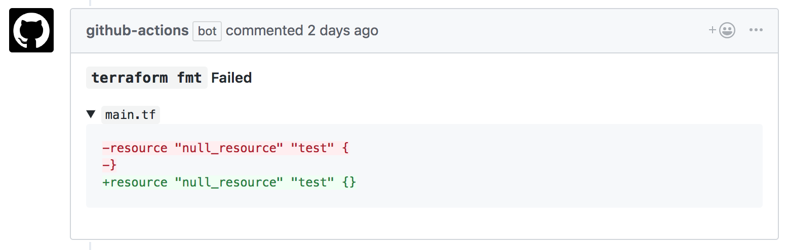
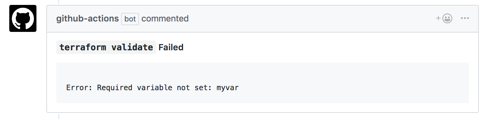
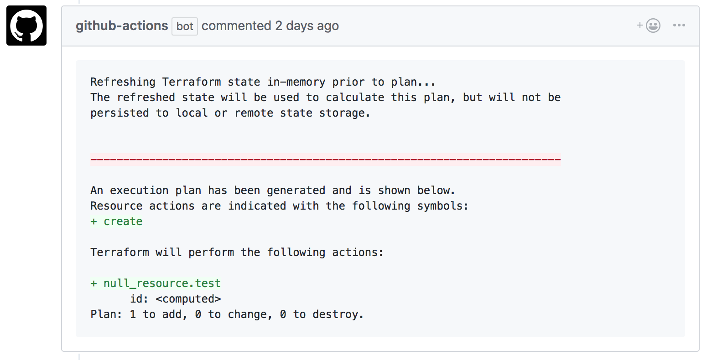

# Terraform GitHub Actions
These official Terraform GitHub Actions allow you to run `terraform fmt`, `validate` and `plan` on your pull requests to help you review and validate Terraform changes.

### Terraform Fmt Action
This action runs `terraform fmt` on your pull request and comments back if any files are not formatted correctly.


### Terraform Validate Action
This action runs `terraform validate` on your pull request and comments back if it fails.


### Terraform Plan Action
This action runs `terraform plan` on your pull request and comments back with the output.


# Usage
To add these actions to your pull requests, you can copy our recommended workflow into your `.github/main.workflow` file or you can write your own workflow.

## Recommended Workflow
This workflow will run `terraform fmt`, `init`, `validate` and `plan`. To add it to your repo, create a `.github/main.workflow` file.

<details><summary>Show</summary>
  
```workflow
# .github/main.workflow
workflow "Terraform" {
  resolves = "terraform-plan"
  on = "pull_request"
}

action "filter-to-pr-open-synced" {
  uses = "docker://superbbears/filter:0.2.0"
  args = ["action", "opened|synchronize"]
}

action "terraform-fmt" {
  uses = "hashicorp/terraform-github-actions/fmt@v0.1"
  needs = "filter-to-pr-open-synced"
  secrets = ["GITHUB_TOKEN"]
  env = {
    # Set to the directory where your Terraform configuration lives.
    # Should be a relative path to the root of the repo, ex. ./mytfdir
    TF_ACTION_WORKING_DIR = "."
  }
}

action "terraform-init" {
  uses = "hashicorp/terraform-github-actions/init@v0.1"
  needs = "terraform-fmt"
  secrets = ["GITHUB_TOKEN"]
  env = {
    TF_ACTION_WORKING_DIR = "."
  }
}

action "terraform-validate" {
  uses = "hashicorp/terraform-github-actions/validate@v0.1"
  needs = "terraform-init"
  secrets = ["GITHUB_TOKEN"]
  env = {
    TF_ACTION_WORKING_DIR = "."
  }
}

action "terraform-plan" {
  uses = "hashicorp/terraform-github-actions/plan@v0.1"
  needs = "terraform-validate"
  secrets = [
    "GITHUB_TOKEN",
    "AWS_ACCESS_KEY_ID",
    "AWS_SECRET_ACCESS_KEY",
  ]
  env = {
    TF_ACTION_WORKING_DIR = "."
    # If you're using Terraform workspaces, set this to the workspace name.
    TF_ACTION_WORKSPACE = "default"
  }
}
```
</details>
